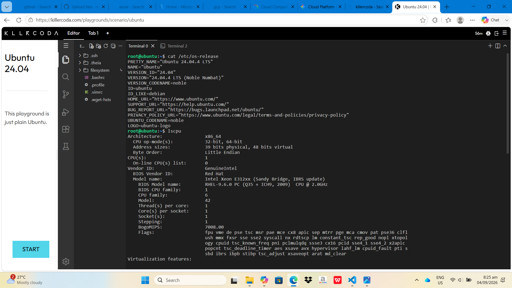

# Laboratory 03: Multi-Cloud Explorer

## System Analysis (KillerCoda Findings)
* **Operating System:** Ubuntu 22.04 LTS (identified via `cat /etc/os-release`)[span_22](start_span)[span_22](end_span)
* **CPU Information:** x86_64 architecture, 2 Virtual CPUs (identified via `lscpu`)[span_23](start_span)[span_23](end_span)
* **Memory:** 4 GB RAM (identified via `free -h`)[span_24](start_span)[span_24](end_span)
* **Disk Space:** 30 GB Root Storage (identified via `df -h`)[span_25](start_span)[span_25](end_span)

## Cloud Migration Strategy
If this Linux server were migrated to the cloud, it could be hosted on the following VM instances[span_26](start_span)[span_26](end_span):
* **AWS:** Amazon EC2 (`t3.medium`)[span_27](start_span)[span_27](end_span)
* **Azure:** Azure Virtual Machine (`Standard_B2s`)[span_28](start_span)[span_28](end_span)
* **GCP:** Google Compute Engine (`e2-medium`)[span_29](start_span)[span_29](end_span)

