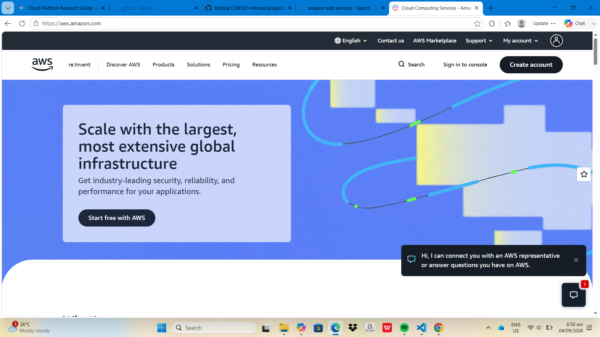

# AWS Research

## Brief Overview
Amazon Web Services (AWS) is a global cloud platform offering scalable computing, storage, networking, and database solutions.

## Global Infrastructure
Composed of global Regions and isolated Availability Zones (AZs) connected with low-latency networking.

## Cloud Management Console
AWS Management Console (Web GUI), AWS CLI, and SDKs.

## Four (4) Core Services
* **Amazon EC2:** Scalable virtual servers in the cloud.
* **Amazon S3:** Object storage built to store and retrieve any amount of data.
* **Amazon VPC:** Isolated virtual network environment.
* **AWS IAM:** Access control and identity management system.

## Three (3) Advantages
* Broadest service catalog and market maturity.
* Massive global infrastructure footprint.
* Highly elastic scaling capabilities.

## Enterprise Use Cases
* Enterprise cloud migrations.
* High-traffic web application hosting.
* Big data processing pipelines.

