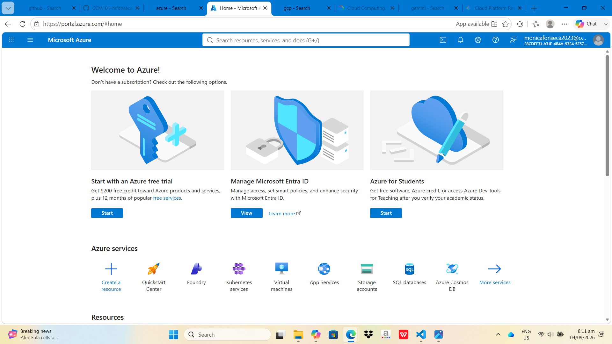

# Microsoft Azure Research

## Brief Overview
Microsoft Azure is an enterprise-focused cloud platform tightly integrated with Windows Server and Active Directory environments.

## Global Infrastructure
Datacenters distributed globally across Azure Regions and Availability Zones.

## Cloud Management Console
Azure Portal (Web GUI), Azure CLI, and PowerShell.

## Four (4) Core Services
* **Azure Virtual Machines:** On-demand compute instances.
* **Azure Blob Storage:** Massively scalable object storage for unstructured data.
* **Azure Virtual Network:** Private network configuration for cloud resources.
* **Microsoft Entra ID:** Cloud-based identity and access management service.

## Three (3) Advantages
* Native integration with Microsoft 365 and Active Directory.
* Robust hybrid cloud deployment options via Azure Arc.
* Strong compliance certifications for enterprise environments.

## Enterprise Use Cases
* Hybrid cloud enterprise deployments.
* Active Directory cloud migration.
* Enterprise Windows software hosting.

