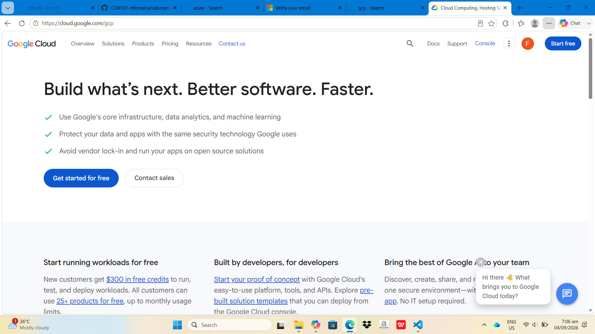

# Google Cloud Platform Research

## Brief Overview
Google Cloud Platform (GCP) is a public cloud platform built for high-performance computing, data analytics, and container management.

## Global Infrastructure
High-speed network of Google datacenters linked by private fiber-optic infrastructure.

## Cloud Management Console
Google Cloud Console, Cloud Shell, and gcloud CLI.

## Four (4) Core Services
* **Google Compute Engine:** Flexible virtual machine infrastructure.
* **Google Cloud Storage:** Unified object storage service.
* **Google Cloud VPC:** Software-defined global private networking.
* **Google Cloud IAM:** Fine-grained authorization and identity governance.

## Three (3) Advantages
* Industry-leading Artificial Intelligence and Machine Learning tools.
* Native Kubernetes management (GKE).
* Fast, private global network backbone.

## Enterprise Use Cases
* AI and Machine Learning model development.
* Real-time big data analytics using BigQuery.
* Containerized application deployments.

